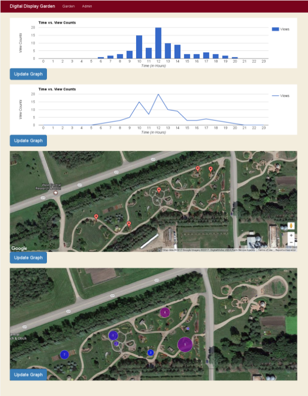

# Google Charts
Everything you need to know about using Google Charts in this and project or any other Angular 2 project.
### Helpful Resources:
* [Google Charts Website:](https://developers.google.com/chart/) A good introduction into what google charts can do.
This resource is also super helpful when finding what types of charts you can use, what options they contain, and how to structure your data.
* [ng2-google-charts:](https://github.com/gmazzamuto/ng2-google-charts) The github page for the library we are using to use Google Charts in Angular.
Use this when trying to figure out how to implement google charts in Angular 2.
We **highly** recommend viewing the demo, and the corresponding source code.

## Adding Gooogle Charts to your project
Because we are using gradle to handle all of our building, using outside libraries gets a whole lot more interesting!
Fortunatly, many hours of our hard work have culiminated in a single line of very easily copy pasteable code for you.
We are using a library called [ng2-google-charts](https://github.com/gmazzamuto/ng2-google-charts) to integrate google charts with Angular 2.
To add *ng2-google-charts* to your project, locate `package.json` in the client directory.
When you are there, copy the following line of code into `dependencies` section.

```ng2-google-charts": "^2.1.0" ```

Next, clean, and rebuild gradle, and you should be good to go!

## How we use Google Charts in our project  
We use google charts to display garden wide data on the admin page.  


Two files on the client side are responsible for creating google charts; `google-component.html`, and `google-component.ts`, located in `client/src/app/admin/`.  

### `google-component.ts`  
In this file, there are several Angular 2 objects representing graphs, and there are functions to update them. When using **ng2-google-charts** in Angular 2, each graph is represented in the typescript file as an object with three paramaters: `chartype`, `dataTable`, and `options`.
#### `chartype`  
This defines what type of chart you are creating, to see options, explore the *google-charts gallery*. (See resource :arrow_up_small:)  
#### `dataTable`  
This is the content of the graph. Make sure to look at examples in the google charts page of the graph you are trying to use. If you want to populate this graph with dynamic data, you want to replicate the structure of a valid dataTable for the graph in a *JSON array*, and set `dataTable` equal to that content.  
**IMPORTANT NOTE**: If you are trying to load data into your graphs from a server request, you still need to have a valid dataTable in your typescript object. Often, the html will load before you have information from the server request. At this point, if there is no dataTable in the object, the graph will throw an exception and never get over it, even when data from the server arrives.  
#### `options`  
This part can get quite exciting. You can look at the example of the graph you are trying to use from google to see a list of all the options availible, and from there the sky is the limit! You can do everything from restricting the size of the graph, to changing axis ranges, to change colors, etc...  
#### `updating functions`  
We struggled with this for a while, but the secret in our update functions is this line of code:
```typescript
this.[NAME OF OBJECT] = Object.create(this.[NAME OF OBJECT]);
```
You need to include it at the top of your updateFunction. Examples of these functions are:
`updateLineChart()`, `updateBarChart()`, and `updateMap()`  
#### other updating functions  
We made the mistake of having another set of functions called `update[BLAH]()`.
Examples of these include: `updateTimeVViewCountLine()`, and `updateBedMetadataMap()`.
These functions grab *JSON Array* data from server requests in `admin.servis.ts`and manipulate it to fit the required `dataTable` syntax if needed.  


138.197.120.23
