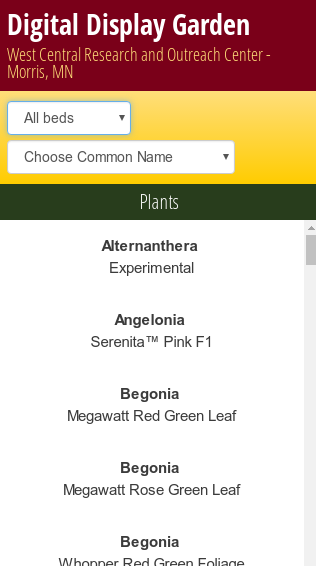
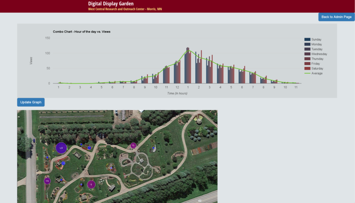

# :movie_camera: :es: *Revolver En Guardia++* :es: :movie_camera:  
   We are *Revolver En Guardia++* :es: :movie_camera:!  
   

We were approached by the West Central Research Outreach Center (WCROC) in Morris Minnesota, to design software that would enhance visitor experience at their horticulture gardens, and provide feedback for WCROC. The Digital Display Garden allows visitors to learn more about the garden, and leave feedback for garden staff, all in a non-obtrusive, low footprint way that doesn't take away from aesthetics of the garden.  
Visitors can access the Digital Display Garden via QR Codes located at each bed. From there, visitors can rate, comment, and view information about the garden. Meanwhile, WCROC staff, can track when and where in the garden people are viewing, liking, and commenting on plants through interactive graphics, and exportable spreadsheets.  
In addition, The Digital Display Garden was designed with low maintenance in mind. WCROC staff can populate the website by uploading a single excel spreadsheet that they already use to keep track of plants into our Admin console. From there, they can change what data the Digital Display Garden is working from, by uploading a corrected spreadsheet using our update function. Getting the correct QR codes for each bed in the garden is a simple as using our *Download QR Codes* feature, that downloads a zipped folder containing all the QR codes needed for the garden. They can regularly view real time data about the garden by using our charts feature, or can download an excel spreadsheet with complete data from all of the garden.   
The Digital Display Garden is due to enter service in the WCROC garden, during summer 2017, and will be further developed to improve visitor and staff experience alike. This project is made possible by the students, and faculty of C-SCI 3601, *Software Development and Design*, at University of Minnesota Morris, and by the staff of the West Central Research Outreach Center.

The Digital Display Garden is due to enter service in the WCROC garden, during summer 2017, and will be further developed to improve visitor and staff experience alike. This project is made possible by the students, and faculty of C-SCI 3601, *Software Development and Design*, at University of Minnesota Morris, and by the staff of the West Central Research Outreach Center.

Software Design S2017, Iteration 4, Team _Revolver en Guardia++_  
You can find our website [here](http://revolverenguardia.dungeon.website)  
Our IP address is: 138.197.120.23

Our Groups team members are:
* Skye Antinozzi (Skyebug)
* Dan Frazier (danfrz)
* Brian Caravantes (carav008)
* Ai Sano (sanox013)
* Andy Hong Lau (tszhonglau)
* Spencer Hammersten (hamme503)
* RJ Holman (holma198)
* Lenny Scott (morrislenny)

This repository is a mirror of [Iteration 3 , Team  Revolver En Guardia](https://github.com/UMM-CSci-3601-S17/digital-display-garden-iteration-4-revolverenguardia-1)
which is a fork from [Iteration 2 , Team _Grimaldi_](https://github.com/UMM-CSci-3601-S17/digital-display-garden-iteration-2-grimaldi.git)
which is a fork from [Iteration 1 , Team _Claude Arabo_](https://github.com/UMM-CSci-3601-S17/digital-display-garden-iteration-1-claudearabo).
and substantially incorporates code from [Iteration 2 , Team _Oman Anwar_](https://github.com/UMM-CSci-3601-S17/digital-display-garden-iteration-2-omaranwar.git)

## Digital Display Garden: Visitor View

## Digital Display Garden: Administration View of Some Garden Statistics

## Documentation  
We have an entire folder full of thorough documentation!
* [Deployment Instructions](/Documentation/DEPLOY.MD): Explains how to start up the project on digital ocean.  
* [Google-Charts](/Documentation/Google-Charts.md): Walks through how we implement Google Charts in Angular 2.  
* [ExcelParser](/Documentation/ExcelParser.md): Explains how the cloud-arabo and Grimaldi iterations parse excel spreadsheets. This wil be updated to reflect how Revolver En Guardia uses `ExcelParser.java`  
* [ExcelFileRequirements](/Documentation/ExcelFileRequirements.md): This will be updated soon to reflect some extra features that Revolver En Guardia have implemented.
* [User Guide](/Documentation/UserGuide/DDGUserGuide-RevolverenGuardia.pdf): This is a guide that explains how the Administration and visitor interface operate.
* [Garden Pamphlet](/Documentation/Pamphlet.md): A document for Steve to take to any conference to show off details about the Digital Display Garden.
* [QR Sign Suggestions](/Documentation/QR-Sign-Suggestions.md): Explains perhaps what might be written on the signs that also contain the QR codes.
* [Development Instructions](/Documentation/Development.md):Explains how to run the project in Development as well as how to simulate running in Production. 
* [Future TODO's and Known Issues](): Explains future goals for the project as well as bugs known to the developers

## Libraries used
### Client-Side
* **Angular 2** 
* **TypeScript** is the language mostly used on the client side
* **Jasmine** and **Karma**
* **Gradle** is used to tell **Yarn** to orchestrate the client side 

### Server-Side
* **Java** is the language used on the server side
* **Spark** is used for the server operations
* **JUnit** is used for testing
* **Apache** is used for importing and exporting data in .xlsx format
* **zxing** is used for generating QR codes (supports reading them if we want)
* **joda** is used for making an unique LiveUploadID
* **Gradle** is used to build the project 

## Resources

- [Bootstrap Components][bootstrap]
- [Mongo's Java Drivers (Mongo JDBC)][mongo-jdbc]
- [What _is_ Angular 2... why TypeScript?][angular-2]
- [What _is_ webpack...?][whats-webpack]
- [Testing Angular 2 with Karma/Jasmine][angular2-karma-jasmine]
- [What is Spark?](http://sparkjava.com/documentation.html)

[angular-2]: https://www.infoq.com/articles/Angular2-TypeScript-High-Level-Overview
[angular2-karma-jasmine]: http://twofuckingdevelopers.com/2016/01/testing-angular-2-with-karma-and-jasmine/
[labtasks]: LABTASKS.md
[travis]: https://travis-ci.org/
[whats-webpack]: https://webpack.github.io/docs/what-is-webpack.html
[bootstrap]: https://getbootstrap.com/components/
[mongo-jdbc]: https://docs.mongodb.com/ecosystem/drivers/java/  

:octopus::fork_and_knife::rice::sushi:
